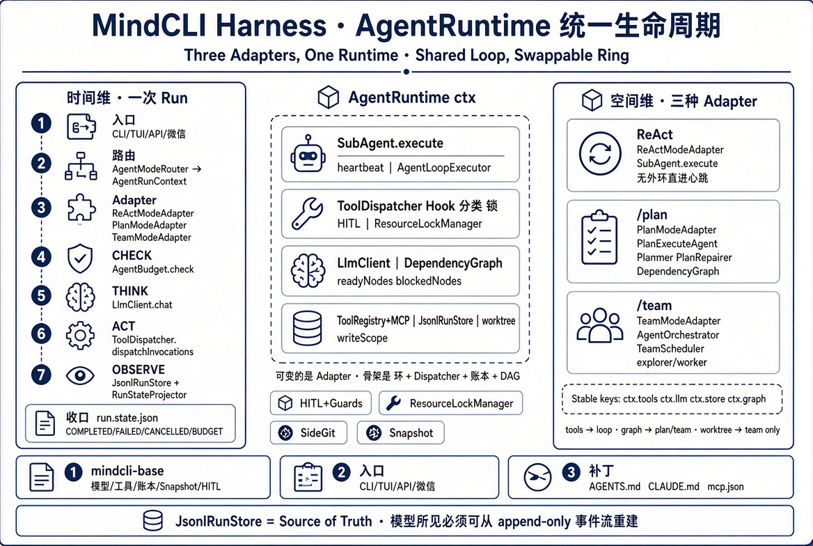
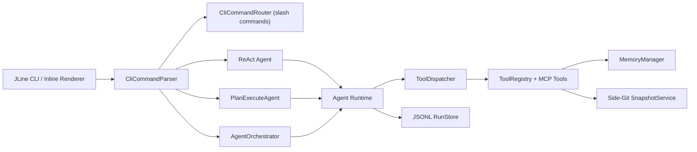
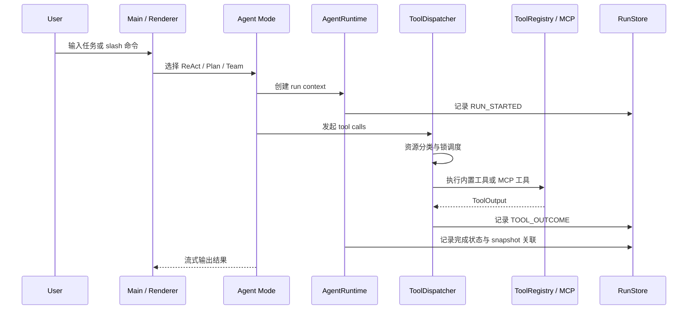

# MindCLI

## 项目架构



MindCLI 是一个 Java 17 + Maven 实现的 Agent CLI，目标是做面向商业使用的本地开发助手，对标 Claude Code。当前代码已经形成三条主执行路径：默认 ReAct、`/plan` 的 Plan-and-Execute，以及 `/team` 的 Multi-Agent 协作；三条路径共享工具注册、记忆、Side-Git 快照和 Agent Runtime 账本。

`mvn clean package` 默认跳过测试，优先产出可手工验收的 `target/mindcli-1.0-SNAPSHOT.jar`；回归测试请显式运行文末的测试命令。

## 快速开始

```bash
cp .env.example .env          # 至少填写一个模型 API Key
mvn clean package             # 打包，默认 skipTests=true
java -jar target/mindcli-1.0-SNAPSHOT.jar
```

Windows CMD 下可复制 `run-mindcli.template.cmd` 为 `run-mindcli.cmd`，按需填写 Java / chafa 路径后运行。模板会启用 UTF-8、inline 和真彩猫耳助手配色；本机 `run-mindcli.cmd` 已被 `.gitignore` 忽略，避免提交个人路径。

可选入口：

```bash
java -jar target/mindcli-1.0-SNAPSHOT.jar wechat setup
java -jar target/mindcli-1.0-SNAPSHOT.jar wechat start

MINDCLI_RUNTIME_API_KEY=local-dev-key \
java -jar target/mindcli-1.0-SNAPSHOT.jar serve --http --port 8080
```

运行前至少配置一个可用 Key：`GLM_API_KEY`、`DEEPSEEK_API_KEY`、`STEP_API_KEY`、`KIMI_API_KEY`、`FREELLMAPI_API_KEY` 或 `XFYUN_MAAS_API_KEY`。

## 架构概览

当前 CLI 生产入口中，默认 ReAct、`/plan` 和 `/team` 都会经 `AgentModeRouter` 创建 `AgentRunContext` 并进入 `AgentRuntime`；三种模式通过 `ReActModeAdapter` / `PlanModeAdapter` / `TeamModeAdapter` 复用统一生命周期、RunStore 和 runtime snapshot 关联，不再额外套旧的 turn snapshot。

同一个 CLI 进程维护轻量的 `SessionContext`，一次会话可以连续执行多个不同模式的 run。每个 run 结束后生成受长度限制的 `RunSummary`，下一次 ReAct、Plan 或 Team 会把最近摘要注入自己的 system prompt，较早摘要合并为历史摘要。`SessionContext` 只负责进程内跨 run 衔接，不改变现有 `~/.mindcli/runs/<runId>/` 账本结构；`/clear` 会同时清空它，长期记忆不受影响。

`/plan` 和 `/team` 保持两套编排模式：前者是单 Agent 的计划审阅、执行、重试与重规划，后者由主代理内部规划，再委派给 explorer / worker profile lease 协作。二者只共享 `DependencyGraph` 的中性 DAG 计算与阻塞依赖诊断，依赖状态语义由各自模式传入。`/plan` 失败恢复按 `critical` / `degradation` 决策：只有 `critical=false + degradation=SKIP` 会跳过，`BLOCK` 直接失败，其余回退为局部重规划。`/team` 内置 `EXPLORER` / `WORKER` 两个子代理，硬编码在源码（`AgentProfile.builtinExplorer` / `builtinWorker`），实例固定为 `explorer#1`、`explorer#2`、`worker#1`，可追加 `.mindcli/agents/*.toml` 自定义子代理，不再读取 `.mindcli/config.toml`；规划职责收编到 orchestrator 内建（直接调 LLM + `TEAM_PLANNER` prompt），无独立 planner 子代理；只读步骤优先由 `explorer` 执行，多个无依赖写入步骤各自使用独立 git worktree 并行执行，完成后先在临时 integration worktree 中统一合并，冲突则整批不更新主工作区并报告冲突文件；执行者随后进入自己的 review->repair 循环，审查失败、输出不可解析或重试耗尽都会 fail closed。





源码包结构：

```text
src/main/java/com/mindcli/
├── agent/       ReAct / Plan / Multi-Agent 编排，plan/ 含 DependencyGraph，team/ 是 Team 编排与调度模型，profile/ 是 Agent Profile 与 profile lease
├── app/         cli / wechat 用户入口与命令 handler；cli/runtime/ 下由 CliRuntimeCoordinator 负责模式运行、CliModeFactory 负责共享依赖组装、CliRunResumer 负责恢复编排、CliRuntimeServerBootstrap 负责 Runtime API/headless 启动，CliCommandRouter 负责低风险 slash 命令分发
├── capability/  browser / image / lsp / mcp / memory（policy/） / skill / tool（builtin/registry/namespace/search/） / web
├── platform/    config / hitl / llm / prompt / render / security / snapshot / text
└── runtime/     run/（facade + store/dispatch/loop/mode/recovery/hook/legacy/session）、api/、task/
```

## 核心能力

| 能力 | 当前实现 |
|---|---|
| 执行模式 | 默认 ReAct；`/plan` 进入计划审阅与执行；`/team` 由 orchestrator 内建规划 + explorer/worker 协作，worker/explorer 自审修复，多个无依赖写入步骤按一 Step 一 worktree 隔离并行，在临时 integration worktree 中合并，冲突不静默覆盖 |
| Runtime 账本 | `JsonlRunStore` 按 run 写 JSONL 事件，单次加载完成 seq 分配、坏尾修复与状态投影，生成 `run.meta.json` / `run.state.json` 并支持 child run 摘要 |
| 工具调度 | `ToolDispatcher` 统一负责并行、批超时、Hook、资源分类、资源锁、结果顺序与结构化 `ToolOutcome`；`ToolRegistry` 只执行单个工具并返回 `ToolExecution`，文件读写/目录枚举由 `FileToolExecutor`、代码搜索由 `CodeSearchToolExecutor`、项目骨架生成由 `ProjectToolExecutor`、Skill 正文加载由 `SkillToolExecutor`、Web 访问由 `WebToolExecutor`、Memory 访问由 `MemoryToolExecutor`、Shell 进程执行由 `ShellCommandExecutor` 承担，锁跟随实际工具线程生命周期，审批策略显式传播到工具线程，需要 HITL 的调用串行提示 |
| 代码理解 | `glob_files` / `grep_code` / `read_file` 实时探索，按需逐步缩小范围 |
| 记忆治理 | `/save` 手动长期记忆；自动提取只生成候选；`/memory approve/reject/export --audit` 管理审计链路 |
| MCP | 仅使用官方 Model Context Protocol Java SDK 2.0.1，合并用户级 `~/.mindcli/mcp.json` 和项目级 `.mindcli/mcp.json`，支持 stdio 与 Streamable HTTP |
| 浏览器 | 默认 `chrome-devtools` MCP isolated 模式，`/browser connect` 通过官方 `--autoConnect` 复用本机 Chrome 登录态 |
| Web | `web_search` 支持 zhipu / serpapi / searxng，`web_fetch` 通过 HTTP + Jsoup 提取 Markdown |
| 安全 | HITL、PathGuard、CommandGuard、BrowserGuard、危险工具 JSONL 审计 |
| 交互体验 | JLine 4 cyber-lite inline/plain renderer、本机 chafa 10x10 随机猫耳助手启动图、猫耳暖色分层启动 Banner、MCP 启动摘要收敛到首屏 note、`MINDCLI //` 底部状态栏、slash 补全、输入高亮、`@path` 与 MCP resource 展开 |
| 其他入口 | 微信 iLink 通道、后台任务 `/task`、本地 Runtime HTTP API |

## 内置工具

| 工具 | 说明 |
|---|---|
| `read_file` | 读取项目根内文件，支持 `offset` / `limit` 分段读取 |
| `write_file` | 写入项目根内文件，单文件 5MB 上限，写后触发 diff / LSP 观察链路 |
| `list_dir` | 列出项目根内目录；枚举期间与该目录下文件写入互斥 |
| `glob_files` | 按 glob 模式查找文件，默认忽略 `.git`、`target`、`node_modules` 等目录 |
| `grep_code` | 按关键字或正则搜索代码，优先 ripgrep，失败时回退 Java 扫描 |
| `execute_command` | 在项目目录执行短时 shell 命令，默认 60 秒超时 |
| `create_project` | 创建 `java` / `python` / `node` 项目骨架 |
| `web_search` / `web_fetch` | 联网搜索与 URL 正文抓取 |
| `save_memory` | 用户明确要求记住时写入长期记忆；写入期间与长期记忆查询互斥 |
| `search_memory` | 按关键词搜索当前项目可见的长期记忆候选，返回 ID、标题、短提示和读取指引；不自动裁决冲突 |
| `read_memory` | 按记忆 ID 读取当前项目可见的单条长期记忆正文 |
| `load_skill` | 加载匹配任务的 `SKILL.md` 全文 |
| `revert_turn` | 恢复到 Side-Git 最近第 N 个 pre-turn 快照 |
| `mcp__{server}__{tool}` | MCP server 动态注册工具 |

## 常用命令

### 工作模式与会话

| 命令 | 说明 |
|---|---|
| `/plan <任务>` | 直接以 Plan-and-Execute 执行任务；无参数时让下一条任务使用 Plan 模式 |
| `/team <任务>` | 直接以 Multi-Agent 执行任务；无参数时让下一条任务使用 Team 模式 |
| `/cancel` | 取消运行中的任务；空闲时提示当前无任务 |
| `/clear` | 清空当前对话历史与短期记忆，长期记忆保留 |
| `/compact` | 手动压缩当前 ReAct conversation history |
| `/context` / `/ctx` | 查看上下文、记忆与 token 状态 |
| `/init` / `/init --force` | 生成或强制重写项目级 `MIND.md` |
| `/export` | 导出当前 ReAct 会话为 Markdown |
| `/history clear` | 清空本机输入历史 |
| `/exit` / `/quit` | 退出程序 |

### 模型与配置

| 命令 | 说明 |
|---|---|
| `/model` | 查看当前模型与可切换 provider |
| `/model glm-5.1` | 切换到 GLM-5.1 |
| `/model glm-5v-turbo` | 切换到 GLM 多模态模型，用于图片输入 |
| `/model deepseek` / `step` / `kimi` / `freellmapi` / `xfyun` | 切换到配置中的 provider |
| `/config` | 打开只读配置 palette，并提示对应 CLI 命令 |
| `/config provider <name> --api-key <key> --model <m> --base-url <url> --default` | 写入 `~/.mindcli/config.json` 的 provider 配置 |
| `/config provider xfyun --lora-id <resourceId>` | 为讯飞星辰 MaaS 微调模型配置 `lora_id` header |

### 记忆系统

| 命令 | 说明 |
|---|---|
| `/save <事实>` | 保存项目级长期记忆 |
| `/save --global <事实>` | 保存跨项目长期偏好 |
| `/memory` / `/mem` | 查看记忆系统状态 |
| `/memory policy` | 查看自动提取、候选、过滤与审计策略 |
| `/memory proposals` | 查看待确认候选记忆 |
| `/memory approve <id>` / `/memory reject <id>` | 批准或拒绝候选 |
| `/memory list` / `/memory search <关键词>` | 查看或搜索长期记忆 |
| `/memory delete <id>` / `/memory clear` | 删除单条或清空长期记忆 |
| `/memory export --audit` | 导出记忆审计证据到 `~/.mindcli/exports/` |

长期记忆默认只通过 `/save` 或用户明确要求保存。每个 session 只注入受 scope/status/expiry 过滤的 `MEMORY.md` 目录，正文不会在 run 启动时自动注入；模型需要时调用 `search_memory` 获取候选，再用 `read_memory` 按 ID 读取正文。多个候选仅表示可能相关，不按更新时间自动裁决，也不自动覆盖或删除；涉及当前项目代码、配置和命令时，必须实时检查项目状态，以当前任务相关且可验证的证据为准，无法确认时请求用户确认。即使开启自动提取，系统也只会生成 `MemoryProposal`，必须经过 `/memory approve <id>` 才会写入长期记忆；自动提取接口返回可等待的 `CompletableFuture`，候选先成功写入 `proposals.jsonl` 再发布到内存，异步失败会保留在 Future 中并记录日志；删除采用 tombstone 语义，审计源是长期记忆目录下的 `audit.jsonl`。

### MCP、浏览器与 Skill

| 命令 | 说明 |
|---|---|
| `/mcp` | 查看所有 MCP server 状态 |
| `/mcp restart <name>` | 重启 server |
| `/mcp logs <name>` | 查看 server 最近 stderr 日志 |
| `/mcp disable <name>` / `/mcp enable <name>` | 运行时禁用或启用 server |
| `/mcp resources <name>` | 查看 server 暴露的 resources |
| `/mcp prompts <name>` | 查看 server 暴露的 prompts |
| `/browser status` | 查看浏览器 MCP 模式与 server 状态 |
| `/browser connect` | 使用 `chrome-devtools-mcp --autoConnect` 复用已授权 Chrome |
| `/browser tabs` | shared 模式下列出真实 Chrome tabs |
| `/browser disconnect` | 切回 isolated 浏览器模式 |
| `/skill list` / `/skill show <name>` | 查看 Skill 列表或完整 `SKILL.md` |
| `/skill on <name>` / `/skill off <name>` / `/skill reload` | 切换启用状态或重新扫描 |

MCP 配置读取顺序为用户级 `~/.mindcli/mcp.json` 后叠加项目级 `.mindcli/mcp.json`，项目同名 server 覆盖用户配置。`${PROJECT_DIR}`、`${HOME}` 与 `${VAR}` 会在单个 server 启动前展开；某个 server 配置错误不会阻塞其他 server。检测到 `STEP_API_KEY` 且未显式配置同名 server 时，会自动加入 `step_search` 远程 MCP。

MCP 初始化、JSON-RPC 编解码和 stdio/Streamable HTTP wire transport 全部由官方 Java SDK 负责，没有自研协议或 transport fallback。MindCLI 只保留配置加载、生命周期、工具命名空间、HITL/审计、内容适配和资源缓存。

示例：

```json
{
  "mcpServers": {
    "chrome-devtools": {
      "command": "npx",
      "args": ["-y", "chrome-devtools-mcp@latest", "--isolated=true"]
    },
    "remote-docs": {
      "url": "https://example.com/mcp",
      "headers": {
        "Authorization": "Bearer ${REMOTE_TOKEN}"
      }
    }
  }
}
```

CLI 启动默认最多等待 MCP server 初始化 8 秒；超时后会先进入输入界面，未完成的 server 在后台继续启动。可用 `MINDCLI_MCP_STARTUP_WAIT_SECONDS` 或 `-Dmindcli.mcp.startup.wait.seconds=30` 调整。

### 安全、快照与后台任务

| 命令 | 说明 |
|---|---|
| `/hitl` / `/hitl on` / `/hitl off` | 查看或切换危险操作人工审批 |
| `/policy` | 查看 PathGuard、CommandGuard 与审计状态 |
| `/audit [N]` | 查看今日最近 N 条危险工具审计 |
| `/snapshot` / `/snapshot status` / `/snapshot clean` | 查看、检查或清理 Side-Git 快照 |
| `/restore <N>` | 回滚到最近第 N 个 pre-turn 快照 |
| `/run inspect <runId>` | 检查 run ledger、snapshot checkpoint、工具调用 ID/状态/参数摘要与恢复提示 |
| `/run resume <runId>` | 恢复可恢复 run；ReAct 会按账本重建单份消息并复用已完成工具结果，同一 `runId + toolCallId + 工具名 + 参数` 再次出现时由 dispatcher 幂等复用，不重复执行；已知高风险调用需 `--confirm`，不确定调用必须人工检查 |
| `/task` / `/task list [N]` | 查看后台任务 |
| `/task add <任务>` | 提交后台任务 |
| `/task cancel <id>` / `/task log <id>` | 取消任务或查看任务日志 |

CLI 启动时会只读扫描当前持久化账本根目录，最多在 Banner 中提示最近 3 个可恢复的父 run；Multi-Agent child run 不会被当成独立任务。该提示不会自动恢复或执行任务，仍需先用 `/run inspect <runId>` 检查，再显式调用 `/run resume <runId>`，原有风险确认、HITL 与策略校验保持不变。

### 微信通道

| 命令 | 说明 |
|---|---|
| `/wechat` | 已绑定时启动通道；未绑定时进入扫码绑定 |
| `/wechat setup` | 重新扫码绑定并启动 |
| `/wechat status` | 查看当前进程内微信通道状态 |
| `/wechat stop` | 停止当前进程内微信通道 |
| `/wechat restart` | 重启当前进程内微信通道 |

微信 iLink 通道默认使用非交互审批策略：只读工具默认允许，命令和 MCP 工具必须命中 allowlist，浏览器会话切换与 `revert_turn` 默认拒绝，文件写入仍受工作区 PathGuard 限制。

## 配置与环境变量

模型配置可写入 `.env`、系统环境变量或 `~/.mindcli/config.json`。`/config provider ...` 会写 `~/.mindcli/config.json`；`.env` 适合本地开发快速启动。

应用运行配置统一按 `JVM system property > OS environment > 项目 .env > 用户 ~/.env > 默认值` 解析；系统属性适合单次启动覆盖，项目 `.env` 优先于用户级通用配置。操作系统、JVM 编码和终端能力探测仍直接读取运行环境，不进入这条配置链。

```bash
# 模型 API Key
GLM_API_KEY=your_key
DEEPSEEK_API_KEY=your_key
STEP_API_KEY=your_key
KIMI_API_KEY=your_key
MOONSHOT_API_KEY=your_key
FREELLMAPI_API_KEY=your_key
XFYUN_MAAS_API_KEY=your_key

# 模型与网关
GLM_MODEL=glm-5.1
DEEPSEEK_MODEL=deepseek-v4-flash
STEP_MODEL=step-3.5-flash
KIMI_MODEL=kimi-k2.6
FREELLMAPI_BASE_URL=http://localhost:5173/v1
XFYUN_MAAS_BASE_URL=https://maas-api.cn-huabei-1.xf-yun.com/v2
XFYUN_MAAS_MODEL=Qwen3.6-35B-A3B
XFYUN_MAAS_LORA_ID=your_resource_id

# Web 搜索
SEARCH_PROVIDER=zhipu       # zhipu | serpapi | searxng
ZHIPU_SEARCH_ENGINE=search_std
SERPAPI_KEY=your_serpapi_key
SEARXNG_URL=http://localhost:8888

# 渲染与日志
MINDCLI_RENDERER=inline     # inline | plain
MINDCLI_NO_STATUSBAR=true
MINDCLI_UI_MASCOT=true      # 检测到本机 chafa 时从 ui/*.png 随机显示 10x10 猫耳助手启动图；false 禁用
MINDCLI_CHAFA_BIN=chafa     # chafa 可执行文件路径；未设置时从 PATH 查找，并继承控制台完成终端探测
MINDCLI_TERMINAL_ENCODING=UTF-8  # 覆盖终端编码；Windows cmd 可用 GBK/GB18030
MINDCLI_TERMINAL_TYPE=xterm-256color  # JLine 将 Windows Terminal 误判为 dumb 时使用
NO_COLOR=1
MINDCLI_LOG_LEVEL=INFO
MINDCLI_LOG_DIR=~/.mindcli/logs

# Runtime
MINDCLI_RUNS_DIR=~/.mindcli/runs
MINDCLI_TASK_DIR=~/.mindcli/tasks
MINDCLI_RUNTIME_API_KEY=your_local_api_key
```

## Runtime HTTP API

Runtime API 只监听 `127.0.0.1`，必须设置 `MINDCLI_RUNTIME_API_KEY` 或 `-Dmindcli.runtime.api.key`。

```bash
MINDCLI_RUNTIME_API_KEY=local-dev-key \
java -jar target/mindcli-1.0-SNAPSHOT.jar serve --http --port 8080
```

接口：

| 方法 | 路径 | 说明 |
|---|---|---|
| `POST` | `/v1/threads` | 创建 thread，返回 `{id, object}` |
| `POST` | `/v1/threads/{threadId}/turns` | 提交 `{ "input": "..." }`，异步运行一轮 |
| `GET` | `/v1/threads/{threadId}/events?after=<id>` | 以 SSE 格式读取事件 |

认证头支持：

```text
Authorization: Bearer <MINDCLI_RUNTIME_API_KEY>
X-MindCLI-API-Key: <MINDCLI_RUNTIME_API_KEY>
```

## 开发与验证

```bash
mvn test -Pquick
mvn test -Pphase16-smoke
mvn test -Dtest=CliCommandParserTest,PlanReviewInputParserTest,MainInputNormalizationTest
mvn test -Dtest=CliCommandRouterTest,MainCommandHandlerRefactorTest
mvn test -Dtest=ToolRegistryTest,ApprovalPolicyTest
mvn test -Dtest=ExecutionPlanTest
mvn test -Dtest=AgentRoleTest,AgentMessageTest,AgentOrchestratorTest
mvn test -DskipTests=false
```

常用文档入口：

| 文档 | 说明 |
|---|---|
| `AGENTS.md` | Agent / 新线程首读入口，包含维护硬规则 |
| `MIND.md` | 项目级记忆，会注入 system prompt |
| `docs/mindcli-current-architecture-report.md` | 当前架构分析报告 |
| `docs/mindcli-agent-runtime-implementation-plan.md` | Agent Runtime 演进实现计划 |
| `ROADMAP.md` | 后续规划，不能等同于已交付功能 |

## 技术栈

- Java 17、Maven、JLine 4
- 官方 MCP Java SDK 2.0.1（`mcp-core` + `mcp-json-jackson2`）
- OkHttp、Jackson、Logback
- SQLite、JavaParser、JGit、Jsoup
- JUnit 5、Mockito、OkHttp MockWebServer

## License

MIT
