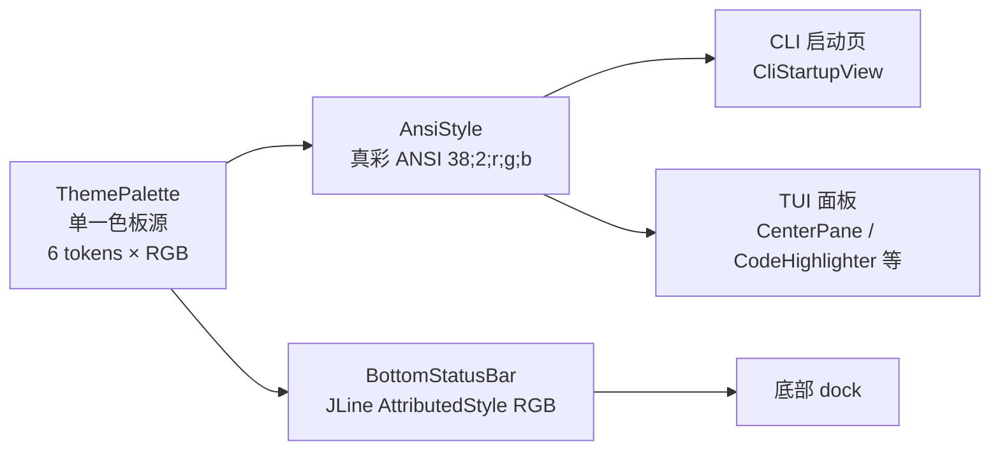

# MindCLI「猫耳女仆」主题升级 — 设计规范

- 日期：2026-08-17
- 状态：已确认（待实现）
- 范围：全局 UI 配色统一到启动猫耳女仆图的暖色调；启动图改为竖版渲染
- 关联计划：`docs/superpowers/plans/2026-08-15-direct-chafa-startup.md`

## 1. 背景与目标

MindCLI 的 UI 配色目前散落在两套互相独立的系统里：

- `AnsiStyle`（`platform/render/terminal/AnsiStyle.java`）：16 色 ANSI 码，`CYAN` / `GREEN` / `YELLOW` / `RED` / `GRAY` / `PURPLE` / `BG_PANEL`，用于 CLI 启动页、TUI 面板、代码高亮等。
- `BottomStatusBar`（`platform/render/inline/BottomStatusBar.java`）：JLine `AttributedStyle` 命名色，`YELLOW` / `GREEN` / `CYAN` / `MAGENTA` / `BLUE` / `RED`，用于底部 dock。

而启动猫耳图（`src/main/resources/ui/noke*.png`）是一套「深墨底 + 奶油白皮肤/女仆裙 + 玫瑰粉/藕粉腮红」的温柔猫耳女仆形象。UI 配色（黄绿青品红）与图片气质完全脱节，且夹带了用户不想要的「科技感」冷灰蓝。

**目标**：

1. 把全局 UI 配色统一到从图片提取的「猫耳女仆」暖色板，去掉一切冷调科技感。
2. 启动猫耳图从 `10×10` 方框改为 `10×24` 竖版，让整只猫耳女仆以正确比例完整显示。

## 2. 主题色板

色值从 `noke7.png` 真彩直方图提取，冷灰蓝（`#B4BEC5` / `#A5AEB3`）已剔除。

| token | 名称 | 色值 | 图内来源 | 语义角色 |
|---|---|---|---|---|
| `ink` | 深墨 | `#0A0D15` | 深色背景 | 全局深底、用户消息块背景 |
| `cream` | 奶油白 | `#F4EDE8` | 皮肤/女仆裙亮部 | 主文字、主标题、模型名、活跃态 |
| `blush` | 浅藕粉 | `#EBD7D1` | 腮红/浅粉 | 次级点缀、代码标签、次要数值 |
| `rose` | 玫瑰粉 | `#D9A9A9` | 腮红/粉裙 | 强调、选中、prompt 前缀、品牌 |
| `taupe` | 暖灰 | `#8C817F` | 阴影过渡 | 弱化文字、思考态、YOLO 模式、空槽 |
| `rouge` | 暖红 | `#E07A7A` | 暖调腮红变体 | 错误、警示、高占用告警 |

色板层次（由亮到暗）：`cream` → `blush` → `rose` → `taupe` → `rouge`（强调红）→ `ink`（底）。

## 3. 架构

引入单一调色板源 `ThemePalette`，`AnsiStyle` 与 `BottomStatusBar` 都从它取值，消除双色源漂移。



`ThemePalette` 每个 token 暴露两个视图：

- `fg()`：返回真彩 ANSI 前景码 `\u001B[38;2;R;G;Bm`，供 `AnsiStyle` 组合使用。
- `jline()`：返回 `AttributedStyle.DEFAULT.foreground(R,G,B)`，供 `BottomStatusBar` 组合使用。

颜色开关仍沿用现有 `AnsiStyle.isEnabled()`（`mindcli.render.color` / `NO_COLOR` / `TERM=dumb`），不改动现有降级逻辑。

## 4. 文件改动

### 4.1 新增 `ThemePalette`（`platform/render/terminal/ThemePalette.java`）

```java
public enum ThemePalette {
    INK(0x0A, 0x0D, 0x15),
    CREAM(0xF4, 0xED, 0xE8),
    BLUSH(0xEB, 0xD7, 0xD1),
    ROSE(0xD9, 0xA9, 0xA9),
    TAUPE(0x8C, 0x81, 0x7F),
    ROUGE(0xE0, 0x7A, 0x7A);

    private final int r, g, b;
    // String fg() -> "\u001B[38;2;" + r + ";" + g + ";" + b + "m"
    // AttributedStyle jline() -> AttributedStyle.DEFAULT.foreground(r, g, b)
}
```

### 4.2 `AnsiStyle`：16 色 → 真彩 `ThemePalette`

保留所有方法签名与 `NO_COLOR` 降级逻辑，仅替换颜色常量来源。

| 方法 | 现状 | 改为 |
|---|---|---|
| `heading` | `BOLD + CYAN` | `BOLD + CREAM` |
| `section` | `BOLD + GREEN` | `BOLD + ROSE` |
| `answerMarker` | `BOLD + GREEN` | `BOLD + ROSE` |
| `subtle` | `DIM + GRAY` | `DIM + TAUPE` |
| `thinking` | `ITALIC + GRAY` | `ITALIC + TAUPE` |
| `codeLabel` | `BOLD + YELLOW` | `BOLD + BLUSH` |
| `error` | `BOLD + RED` | `BOLD + ROUGE` |
| `quotePrefix` | `DIM + CYAN` | `DIM + TAUPE` |
| `emphasis` | `BOLD`（无色） | 不变（跟随默认前景） |
| `userMessageBlock` 背景 | `BG_PANEL`(48;5;236) | `INK` 背景真彩 |
| `userMessageBlock` 前缀 `>` | `PURPLE`(38;5;141) | `ROSE` |

删除不再使用的 `CYAN / GREEN / YELLOW / RED / GRAY / PURPLE / BG_PANEL` 常量，改为从 `ThemePalette` 取色。

### 4.3 `BottomStatusBar`：命名色 → `ThemePalette.jline()`

| 常量 | 现状 | 改为 |
|---|---|---|
| `MODE_YOLO_STYLE` | YELLOW bold | TAUPE bold |
| `MODE_HITL_STYLE` | GREEN bold | ROSE bold |
| `MCP_STYLE` | CYAN | BLUSH |
| `SKILL_STYLE` | MAGENTA | ROSE |
| `BRAND_STYLE` | MAGENTA bold | ROSE bold |
| `MODEL_STYLE` | CYAN bold | CREAM bold |
| `PHASE_IDLE_STYLE` | GREEN | ROSE |
| `PHASE_ACTIVE_STYLE` | YELLOW bold | CREAM bold |
| `CTX_LABEL_STYLE` | BLUE bold | BLUSH bold |
| `CTX_FILL_STYLE` | GREEN bold | ROSE bold |
| `CTX_EMPTY_STYLE` | BLUE faint | TAUPE faint |
| `TOKEN_LABEL_STYLE` | YELLOW | BLUSH |
| `CACHE_LABEL_STYLE` | MAGENTA | ROSE |
| `ELAPSED_STYLE` | YELLOW | TAUPE |
| `CWD_STYLE` | faint | 不变 |
| `contextPercentStyle` | ≥90 RED / ≥70 YELLOW / else GREEN | ≥90 ROUGE / ≥70 ROSE / else BLUSH |

`style(AttributedStyle)` 包装函数保留，仍通过 `AnsiStyle.isEnabled()` 做降级。

### 4.4 `TerminalMascotRenderer`：竖版渲染

- `CHAFA_ROWS` 从 `10` 改为 `24`（`CHAFA_COLUMNS` 保持 `10`）。
- 图片比例约 `1:2.2~2.3`（约 500×1200），`10×24` 框内 chafa 自动保真比例，可完整显示猫耳女仆全身。
- `command(...)` 中 `-s 10x24` 随之生效，无需其它改动。

### 4.5 TUI 面板（间接生效）

`CenterPane`、`CodeHighlighter`、`TuiBootstrap`、`CliStartupView` 等均通过 `AnsiStyle` 取色，随 4.2 自动生效，无需单独修改。

## 5. 非目标（YAGNI）

- 不做主题切换 / 亮暗双主题 / 用户自定义配色（当前只有一套硬编码主题）。
- 不做图片重新生成或新增素材（沿用现有 `noke*.png`）。
- 不改动任何文本内容、布局、光标逻辑或 JLine dock 结构，只改颜色与渲染尺寸。
- 不引入第三方取色/渲染依赖。

## 6. 验证

1. `mvn test` 通过（重点：`AnsiStyle`、`BottomStatusBar`、`TerminalMascotRenderer` 相关测试若有颜色断言需同步更新）。
2. 启动 CLI（`NO_TUI=true`）确认：猫耳图为竖版全宽、标题奶油白、提示暖灰、无青色/绿色/亮黄残留。
3. 启动 TUI 确认：文件树/聊天区/代码标签为奶油白 + 玫瑰粉 + 浅藕粉；底部 dock 从「黄绿青品红」变为「玫瑰粉/浅藕粉/暖灰/奶油白」。
4. 触发错误与高上下文占用（≥90%）确认：错误/告警显示暖红 `rouge`，一眼可辨但不刺眼。
5. 设 `NO_COLOR=1` 确认：全部颜色关闭，纯文本输出正常。

## 7. 遗留问题

- `rouge`（暖红 `#E07A7A`）与 `rose`（玫瑰粉 `#D9A9A9`）在低端 256 色终端上可能较接近；若需更强区分，可将 `rouge` 调整为更饱和的暖红，待真机验证后决定。
