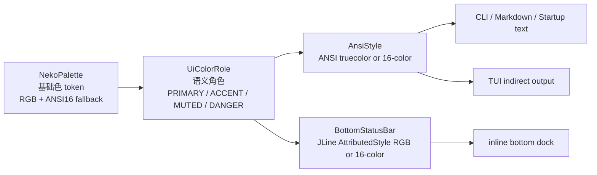

# MindCLI「猫耳助手」暖色 UI 升级 — 技术方案

- 日期：2026-08-18
- 状态：已确认（方案优化版，待实现）
- 范围：统一 MindCLI 自身输出配色，让 CLI / inline dock / TUI 呈现猫耳少女助手的暖色气质

## 1. 背景与目标

MindCLI 当前 UI 配色分散在两套实现里：

- `AnsiStyle`（`platform/render/terminal/AnsiStyle.java`）：使用 16 色 ANSI 常量，如 `CYAN` / `GREEN` / `YELLOW` / `RED` / `GRAY` / `PURPLE` / `BG_PANEL`，覆盖 CLI 启动页、普通输出、Markdown、TUI 间接输出等。
- `BottomStatusBar`（`platform/render/inline/BottomStatusBar.java`）：使用 JLine `AttributedStyle` 命名色，如 `YELLOW` / `GREEN` / `CYAN` / `MAGENTA` / `BLUE` / `RED`，覆盖 inline 底部 dock。

启动图资源 `src/main/resources/ui/noke*.png` 已经是猫耳少女 / 女仆助手方向：深墨背景、奶油白、浅藕粉、玫瑰粉、暖灰阴影。现有 UI 的青绿黄紫偏冷、偏科技，与图片气质脱节。

目标：

1. 把 MindCLI 自身输出统一成「猫耳助手」暖色 UI。
2. 保持极简，不做主题系统、不做用户自定义主题、不修改用户终端全局主题。
3. 建立一个小而深的颜色接口，避免颜色再次散落到 `AnsiStyle` / `BottomStatusBar` / TUI 各处。
4. 支持真彩终端的细腻色彩，同时给非真彩终端保留 16 色降级，而不是直接退化成默认色。

## 2. 非目标

- 不做主题切换、亮暗双主题、配置文件主题或运行时切换。
- 不使用 OSC 序列修改终端窗口的全局前景色、背景色或调色板，避免污染用户终端。
- 不改启动图渲染方式、`chafa` 参数、启动布局、LineReader 输入逻辑、dock 行数或 TUI 三栏布局。
- 不新增第三方取色或渲染依赖。
- 不把「女仆」作为代码接口命名的长期抽象；代码命名采用 `Neko` / `Assistant`，文件名保留历史设计文档名称即可。

## 3. 色板

色值应从 `src/main/resources/ui/noke*.png` 的共同视觉风格中提取，而不是只绑定单张图片。`noke7.png` 可作为参考样本，但实现文档以 8 张启动图的稳定共性为准。

### 3.1 基础颜色 Token

| token | 名称 | RGB | 16 色降级 | 图内来源 | 用途 |
|---|---|---:|---|---|---|
| `INK` | 深墨 | `#0A0D15` | black | 深色背景 | 全局暗底参考，不主动改终端背景 |
| `PANEL` | 面板底 | `#1F1C22` | bright black background | 深背景亮部 | 用户消息块背景 |
| `CREAM` | 奶油白 | `#F4EDE8` | bright white | 皮肤/裙装亮部 | 主文字、模型名、活跃态 |
| `BLUSH` | 浅藕粉 | `#EBD7D1` | white | 腮红/浅粉 | 次级点缀、标签、辅助数值 |
| `ROSE` | 玫瑰粉 | `#D9A9A9` | magenta | 腮红/粉色衣饰 | 品牌、选中、prompt 前缀、强调 |
| `ROUGE` | 暖红 | `#E05F6F` | red | 暖调告警色 | 错误、警告、高占用 |
| `TAUPE` | 暖灰 | `#8C817F` | bright black | 阴影过渡 | 弱化文字、thinking、空槽、cwd |

说明：

- `ROUGE` 比原方案的 `#E07A7A` 略提高区分度，避免和 `ROSE` 太接近。
- `INK` 只是设计基准，不主动写整个终端背景；也不作前景使用（16 色降级 `black` 在黑色终端上不可见）。
- `PANEL` 只用于 MindCLI 自己绘制的块背景，例如 `userMessageBlock`。

### 3.2 语义颜色角色

生产代码不应让调用点直接选择 `CREAM` / `ROSE` 这种图片色名，而应消费语义角色：

| role | 真彩 token | 16 色降级 | 语义 |
|---|---|---|---|
| `PRIMARY` | `CREAM` | bright white | 主标题、模型名、活跃态 |
| `ACCENT` | `ROSE` | magenta | 品牌、选中、用户前缀 |
| `SECONDARY` | `BLUSH` | white | 标签、MCP/SKILL、token label |
| `MUTED` | `TAUPE` | bright black | 弱化文字、thinking、cwd、空槽 |
| `DANGER` | `ROUGE` | red | 错误、告警、上下文高占用 |
| `PANEL_BG` | `PANEL` | bright black background | 用户消息块背景 |

> 16 色降级注意：`PRIMARY`（CREAM→bright white）与 `SECONDARY`（BLUSH→white）在 16 色下接近同色，层次靠字重（bold / faint / italic）而非色相区分。这是 16 色能力有限的刻意取舍。

这样后续即使微调图片取色，也只改色板，不需要逐个审查 `heading()`、`section()`、dock 常量等调用点。

## 4. 架构

引入两个小模块：

- `NekoPalette`：纯数据，提供基础颜色 token 的 RGB 和 16 色降级。
- `UiColorRole`：语义角色，声明每个 role 对应哪个基础 token。

`AnsiStyle` 和 `BottomStatusBar` 都只消费 `UiColorRole`，各自在自己的渲染世界里做格式转换。



接口设计要点：

- `NekoPalette` 不 import JLine，不拼 ANSI 转义，只暴露 `r()` / `g()` / `b()` / `ansi16()`。
- `UiColorRole` 不关心终端能力，只映射到 `NekoPalette`。
- `AnsiStyle` 负责决定输出真彩 ANSI、16 色 ANSI 或无色文本。
- `BottomStatusBar` 负责把同一角色转换成 JLine `AttributedStyle`。
- 颜色开关仍由 `AnsiStyle.isEnabled()` 统一决定，保持 `mindcli.render.color=false`、`NO_COLOR`、`TERM=dumb` 的现有语义。

这个 seam 的好处是：调用点只知道“我要主色 / 强调色 / 危险色”，不用知道猫耳图的具体 RGB，也不用知道当前终端支持真彩还是 16 色。

## 5. 终端能力与降级

目标环境是大多数用户的默认终端：通常为黑色/深色背景，且多为 256 色或仅 16 色、往往未设置 `COLORTERM`。因此默认**不假设真彩**：只有显式确认真彩才输出 `38;2`，否则走 16 色降级。这是针对目标用户群的有意取舍——宁可在能力不明的终端上观感保守，也不输出可能渲染异常的真彩。

颜色输出分三档：

1. **无色**：`AnsiStyle.isEnabled() == false`，所有样式退回纯文本 / JLine default。
2. **真彩**：`COLORTERM=truecolor` / `COLORTERM=24bit`，或用户显式设置 `-Dmindcli.render.truecolor=true` / `MINDCLI_TRUECOLOR=true`，使用 `38;2;r;g;b` / `48;2;r;g;b`。
3. **16 色**：颜色开启但未确认真彩时，使用基础 token 的 16 色降级。

建议新增：

- `AnsiStyle.supportsTrueColor()`：按以下优先级判定（与现有 `isEnabled()` 的「属性优先」一致）：
  1. `-Dmindcli.render.truecolor`（系统属性，显式，最高）
  2. `MINDCLI_TRUECOLOR`（环境变量）
  3. `COLORTERM` 为 `truecolor` 或 `24bit`
- `AnsiStyle.fg(UiColorRole role)` / `AnsiStyle.bg(UiColorRole role)`：根据能力选择真彩或 16 色。
- `BottomStatusBar.roleStyle(UiColorRole role)`：真彩时使用 `.foreground(r,g,b)`；非真彩时使用 `.foreground(AttributedStyle.<ANSI16>)`。

注意：`MINDCLI_TERMINAL_TYPE=xterm-256color` 不等于真彩，只表示基础 ANSI 能力；真彩优先看 `COLORTERM` 或显式开关。

## 6. 文件改动

### 6.1 新增 `NekoPalette`

路径：`src/main/java/com/mindcli/platform/render/terminal/NekoPalette.java`

```java
public enum NekoPalette {
    INK(0x0A, 0x0D, 0x15, Ansi16.BLACK),
    PANEL(0x1F, 0x1C, 0x22, Ansi16.BRIGHT_BLACK),
    CREAM(0xF4, 0xED, 0xE8, Ansi16.BRIGHT_WHITE),
    BLUSH(0xEB, 0xD7, 0xD1, Ansi16.WHITE),
    ROSE(0xD9, 0xA9, 0xA9, Ansi16.MAGENTA),
    ROUGE(0xE0, 0x5F, 0x6F, Ansi16.RED),
    TAUPE(0x8C, 0x81, 0x7F, Ansi16.BRIGHT_BLACK);

    // Pure data only: no ANSI strings, no JLine imports.
}
```

### 6.2 新增 `UiColorRole`

路径：`src/main/java/com/mindcli/platform/render/terminal/UiColorRole.java`

```java
public enum UiColorRole {
    PRIMARY(NekoPalette.CREAM),
    ACCENT(NekoPalette.ROSE),
    SECONDARY(NekoPalette.BLUSH),
    MUTED(NekoPalette.TAUPE),
    DANGER(NekoPalette.ROUGE),
    PANEL_BG(NekoPalette.PANEL);
}
```

### 6.3 新增或内嵌 `Ansi16`

如果只被 `NekoPalette` / `AnsiStyle` 使用，可放在 `terminal` 包下，但推荐保持 `terminal` 包对 JLine 零依赖：

- `Ansi16` 只保存 ANSI 前景/背景 code。
- `BottomStatusBar` 自己做 `Ansi16 -> AttributedStyle` 的 switch。

示意：

```java
enum Ansi16 {
    BLACK(30, 40),
    RED(31, 41),
    MAGENTA(35, 45),
    WHITE(37, 47),
    BRIGHT_BLACK(90, 100),
    BRIGHT_WHITE(97, 107);
}
```

### 6.4 改造 `AnsiStyle`

保留现有公开方法签名，降低调用点改动：

| 方法 | 新角色 |
|---|---|
| `heading` | `BOLD + PRIMARY` |
| `section` | `BOLD + ACCENT` |
| `answerMarker` | `BOLD + ACCENT` |
| `subtle` | `DIM + MUTED` |
| `thinking` | `ITALIC + MUTED` |
| `codeLabel` | `BOLD + SECONDARY` |
| `error` | `BOLD + DANGER` |
| `quotePrefix` | `DIM + MUTED` |
| `emphasis` | `BOLD`，不加颜色 |
| `userMessageBlock` 背景 | `PANEL_BG` |
| `userMessageBlock` 前缀 `>` | `ACCENT` |

删除散落的旧颜色常量：`CYAN` / `GREEN` / `YELLOW` / `RED` / `GRAY` / `PURPLE` / `BG_PANEL`。

### 6.5 改造 `BottomStatusBar`

保持布局和字段顺序不变，只替换样式来源：

| 常量 | 新角色 |
|---|---|
| `MODE_YOLO_STYLE` | `MUTED bold` |
| `MODE_HITL_STYLE` | `ACCENT bold` |
| `MCP_STYLE` | `SECONDARY` |
| `SKILL_STYLE` | `ACCENT` |
| `BRAND_STYLE` | `ACCENT bold` |
| `MODEL_STYLE` | `PRIMARY bold` |
| `PHASE_IDLE_STYLE` | `ACCENT` |
| `PHASE_ACTIVE_STYLE` | `PRIMARY bold` |
| `CTX_LABEL_STYLE` | `SECONDARY bold` |
| `CTX_FILL_STYLE` | `ACCENT bold` |
| `CTX_EMPTY_STYLE` | `MUTED faint` |
| `TOKEN_LABEL_STYLE` | `SECONDARY` |
| `CACHE_LABEL_STYLE` | `ACCENT` |
| `ELAPSED_STYLE` | `MUTED` |
| `CWD_STYLE` | `MUTED faint` |
| `contextPercentStyle >= 90` | `DANGER bold` |
| `contextPercentStyle >= 70` | `ACCENT bold` |
| `contextPercentStyle < 70` | `SECONDARY bold` |

状态栏的信息优先级必须保持：

1. 品牌 / 模型 / active phase 最强。
2. MCP / SKILL / token label 中等。
3. cwd / elapsed / YOLO / 空槽最弱。
4. 只有错误、高上下文占用、危险状态使用 `DANGER`。

### 6.6 TUI 面板

`CenterPane`、`CodeHighlighter`、`TuiBootstrap`、`CliStartupView` 等通过 `AnsiStyle` 的路径会自动生效。实现后需要搜索是否还有直接使用 `AttributedStyle.CYAN`、`GREEN`、`MAGENTA` 等的 TUI 代码；若存在，按 `UiColorRole` 迁移。

## 7. 测试与验证

自动化测试：

1. `AnsiStyleTest`
   - `mindcli.render.color=false` 时不输出 ANSI。
   - `NO_COLOR` 时不输出 ANSI。
   - 真彩开启时输出 `38;2` / `48;2`。
   - 真彩关闭但颜色开启时输出 16 色 ANSI。
   - `userMessageBlock` 在有色 / 无色情况下可见宽度不变。
2. `BottomStatusBarTest`
   - `formatStatusLines` 的列宽不变。
   - `NO_COLOR` 时样式退回 default。
   - 高上下文占用使用危险角色。
3. 搜索测试或静态检查
   - `platform/render` 下不再新增裸 `AttributedStyle.CYAN/GREEN/YELLOW/MAGENTA/BLUE/RED` 作为业务语义色。
   - `AnsiStyle` 不再保留旧 `CYAN/GREEN/YELLOW/GRAY/PURPLE/BG_PANEL` 常量。

手工验证：

1. CMD / Windows Terminal 启动：猫耳图正常，文字 UI 呈奶油白、玫瑰粉、暖灰，无青绿亮黄残留。
2. 设置 `COLORTERM=truecolor`：确认真彩色更接近图片。
3. 不设置 `COLORTERM`：确认 16 色降级仍可读。
4. 设置 `NO_COLOR=1`：确认全部颜色关闭，纯文本正常。
5. 触发错误输出与 `CTX >= 90%`：确认 `DANGER` 足够醒目。

建议命令：

```bash
mvn test -Dtest=AnsiStyleTest,BottomStatusBarTest
mvn clean package
```

## 8. 风险与应对

| 风险 | 影响 | 应对 |
|---|---|---|
| `ROSE` 和 `ROUGE` 区分度不足 | 错误不醒目 | 首版使用 `#E05F6F`，真机仍不足再提高饱和度 |
| 部分终端不支持真彩 | 颜色偏差 | 16 色降级，不强依赖真彩 |
| TUI 存在绕过 `AnsiStyle` 的颜色 | 局部仍偏冷 | 实现阶段搜索并迁移直接命名色 |
| 粉色过多降低扫读能力 | 状态栏信息糊成一片 | 严格按语义角色和信息优先级使用颜色 |
| 修改终端全局颜色污染用户环境 | 用户体验差 | 明确禁止 OSC 全局调色板/背景修改 |

## 9. 最终判断

本方案不是主题系统，而是一套产品默认视觉语言。实现时应保持接口小、语义清晰：

- 调用点只使用 `AnsiStyle.heading(...)`、`AnsiStyle.error(...)` 或 `UiColorRole`。
- RGB、16 色降级、真彩判断都集中在渲染底层。
- 任何新 UI 输出都优先复用现有语义角色，不新增一次性颜色常量。
