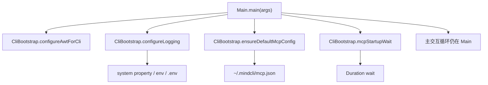
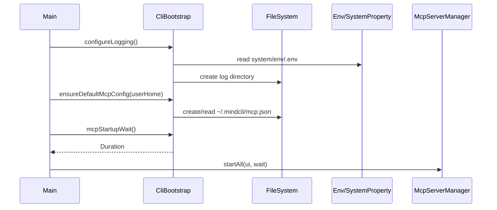

# MindCLI Main CLI `CliBootstrap` 启动配置拆分技术文档

文档类型: 批次级技术方案  
编写日期: 2026-08-10  
适用范围: `src/main/java/com/mindcli/cli/`, `src/test/java/com/mindcli/cli/`, `AGENTS.md`

## 1. 背景

`Main.java` 经过前几批重构后，slash command 的目录、浏览器、配置、导出、快照、run inspect、微信通道都已经沉到专门 handler。当前 `Main` 仍包含一批启动前置配置 helper:

- macOS AWT headless 配置
- 日志系统属性初始化
- `.env` / 系统属性 / 环境变量读取
- `~` 路径展开
- MCP 默认配置文件创建
- MCP 启动等待时间解析
- startup note 合并

这些逻辑属于 CLI bootstrap 基础设施，与 ReAct / Plan / Multi-Agent 主循环无关，且已有单测覆盖其中一部分。将它们抽到 `CliBootstrap` 能继续降低 `Main` 的职责密度，同时避免触碰高风险交互循环。

## 2. 非目标

- 不重排 `main(String[] args)` 的启动顺序。
- 不抽取 while 输入循环、slash command switch 或 Agent 执行分支。
- 不改 Renderer / LineReader / Terminal 的创建时机。
- 不改 Runtime API server 的阻塞启动实现。
- 不改 MCP 默认配置内容、日志默认值、环境变量优先级。
- 不创建 Git commit。

## 3. 目标结构

```text
cli/
├── CliBootstrap.java
├── Main.java
├── command/
└── interaction/
```

## 4. 目标调用关系





## 5. 拆分范围

迁移到 `CliBootstrap`:

- `configureAwtForCli()`
- `isMacOs()`
- `configureLogging()`
- `configureLogProperty(...)`
- `expandHome(...)`
- `loadConfigValue(...)`
- `readValueFromFile(...)`
- `mcpStartupWait()`
- `appendStartupNote(...)`
- `ensureDefaultMcpConfig(...)`

保留在 `Main` 的兼容 facade:

- `configureAwtForCli()`
- `isMacOs()`
- `mcpStartupWait()`
- `ensureDefaultMcpConfig(...)`

`Main.McpConfigBootstrapResult` 暂时保留，`CliBootstrap` 与 `Main` 同包，可直接返回该 record，避免扩大 DTO 迁移范围。

## 6. 行为保持要求

- macOS 下仍设置 `java.awt.headless=true`；非 macOS 不设置。
- 日志目录默认仍为 `~/.mindcli/logs`。
- 日志属性优先级仍为 system property > env / `.env` > 默认值。
- `MINDCLI_MCP_STARTUP_WAIT_SECONDS` / `mindcli.mcp.startup.wait.seconds` 默认仍为 8 秒；非法值或非正数回退 8 秒。
- `ensureDefaultMcpConfig` 仍只在缺文件时创建默认 chrome-devtools MCP 配置；已有文件不覆盖。
- 检测到已有配置但没有 `chrome-devtools` 时，仍只返回提示，不修改文件。

## 7. 验证策略

TDD RED:

```bash
mvn test "-Dtest=MainCliBootstrapRefactorTest" -DskipTests=false
```

本批目标验证:

```bash
mvn test "-Dtest=MainCliBootstrapRefactorTest,MainConfigBootstrapTest,MainInputNormalizationTest,MindCliHistoryTest" -DskipTests=false
```

CLI handler 回归:

```bash
mvn test "-Dtest=MainCommandHandlerRefactorTest,MainConfigCommandHandlerRefactorTest,MainWechatCommandHandlerRefactorTest,MainBrowserCommandTest" -DskipTests=false
```

最终回归:

```bash
mvn test -Pquick
git diff --check
```

## 8. 后续边界

本批完成后，`Main` 的进一步治理可以进入“启动编排对象化”，例如 `CliRuntimeContext` 或 `InteractiveCliSession`。这会触碰 Terminal / Renderer / LineReader 生命周期、MCP 启动与 Agent 初始化顺序，风险高于本批，需要单独设计和更偏集成的验证。
