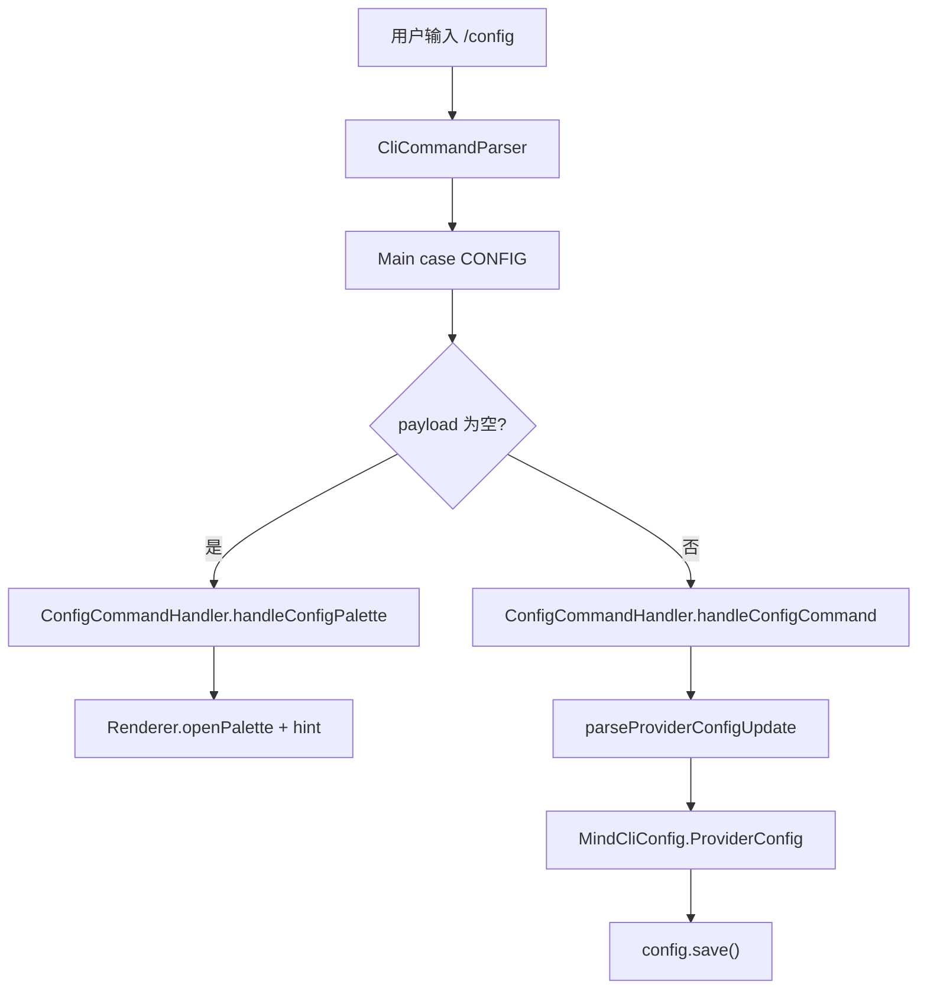
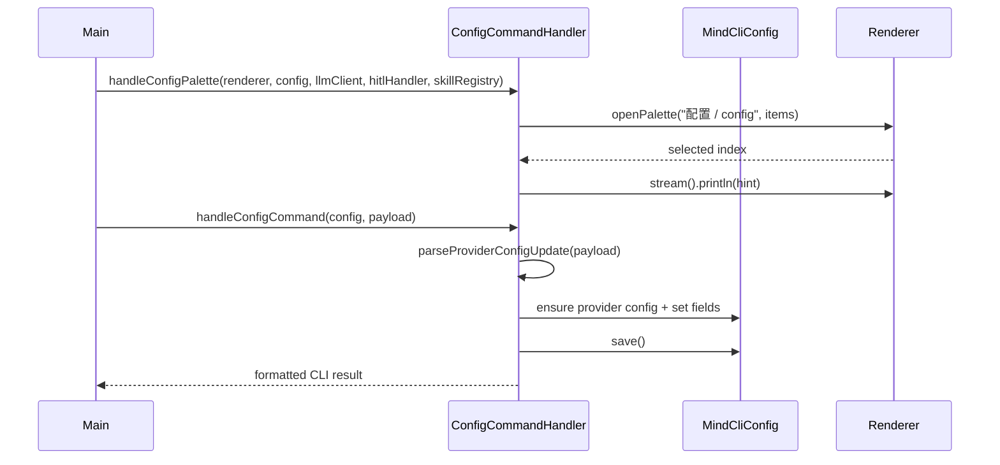

# MindCLI Main CLI `/config` 命令处理层拆分技术文档

文档类型: 批次级技术方案  
编写日期: 2026-08-10  
适用范围: `src/main/java/com/mindcli/cli/`, `src/test/java/com/mindcli/cli/`, `AGENTS.md`

## 1. 背景

`Main.java` 已完成 slash command catalog、`/browser`、`/export`、`/snapshot`、`/restore`、`/run inspect` 的低风险拆分。当前 `/config` 仍在 `Main` 内直接承担两类职责:

- 无 payload: 通过 `Renderer.openPalette(...)` 展示只读配置面板，并输出操作提示。
- 有 payload: 解析 `/config provider ...`，更新 `MindCliConfig` 中的 provider 配置并保存。

这两类职责与 CLI 主循环、模型切换执行、Renderer 生命周期相邻但可独立测试，适合继续沉到 `cli/command/ConfigCommandHandler.java`，让 `Main` 继续收敛为入口 facade。

## 2. 非目标

- 不改 `/model` 的即时模型切换逻辑。
- 不改 `MindCliConfig` 的配置文件结构、保存路径或序列化方式。
- 不改 `/config provider ...` 的参数语法、provider alias、错误文案和输出格式。
- 不把配置面板改成可写 UI，仍保持只读提示。
- 不改 API Key 脱敏规则。
- 不创建 Git commit。

## 3. 目标结构

```text
cli/
├── Main.java
└── command/
    ├── BrowserCommandHandler.java
    ├── ConfigCommandHandler.java
    ├── ExportCommandHandler.java
    ├── RunCommandHandler.java
    ├── SnapshotCommandHandler.java
    └── SlashCommandCatalog.java
```

## 4. 目标调用关系





## 5. 拆分范围

迁移到 `ConfigCommandHandler`:

- `handleConfigPalette(...)`
- `handleConfigCommand(...)`
- `parseProviderConfigUpdate(...)`
- `providerConfigUsage()`
- `splitArgs(...)`
- `normalizeConfigKey(...)`
- `normalizeProviderName(...)`
- `isSupportedProvider(...)`
- `maskSecret(...)`
- provider config 创建 helper

保留在 `Main` 的兼容 facade:

- `handleConfigCommand(...)`
- `parseProviderConfigUpdate(...)`
- `ProviderConfigUpdate` record

其中 `ProviderConfigUpdate` 暂时保留在 `Main`，由 handler 返回/接收 `Main.ProviderConfigUpdate`，避免一次性扩大 API 迁移范围。后续如果继续降低 `Main` 耦合，可再把 record 移到 handler 或独立 DTO。

## 6. 行为保持要求

- `/config` 无参数仍打开只读 palette。
- palette 文案、选中项 hint 和关闭输出保持一致。
- `/config provider free-llm-api ...` 仍归一化为 `freellmapi`。
- `/config provider maas ...` / `xfyun-maas` 等 alias 仍归一化为 `xfyun`。
- `--api-key` / `--base-url` / `--model` / `--lora-id` / `--default` / `--set-default` 解析保持一致。
- `--lora-id` 仍只允许 `xfyun` provider。
- 输出中的 API Key 仍按原规则脱敏。
- 空配置更新仍返回“至少提供一个配置项”。

## 7. 验证策略

TDD RED:

```bash
mvn test "-Dtest=MainConfigCommandHandlerRefactorTest" -DskipTests=false
```

本批目标验证:

```bash
mvn test "-Dtest=CliCommandParserTest,MainConfigCommandHandlerRefactorTest,MainConfigBootstrapTest,MainInputNormalizationTest" -DskipTests=false
```

CLI 命令回归:

```bash
mvn test "-Dtest=MainCommandHandlerRefactorTest,MainBrowserCommandTest" -DskipTests=false
```

最终回归:

```bash
mvn test -Pquick
git diff --check
```

## 8. 后续批次

本批完成后，剩余 Main 结构治理优先级:

- `WechatCliCommandHandler`: `/wechat setup/status/stop/start`
- `CliBootstrap`: Terminal / Renderer / LineReader / Runtime API 启动编排
