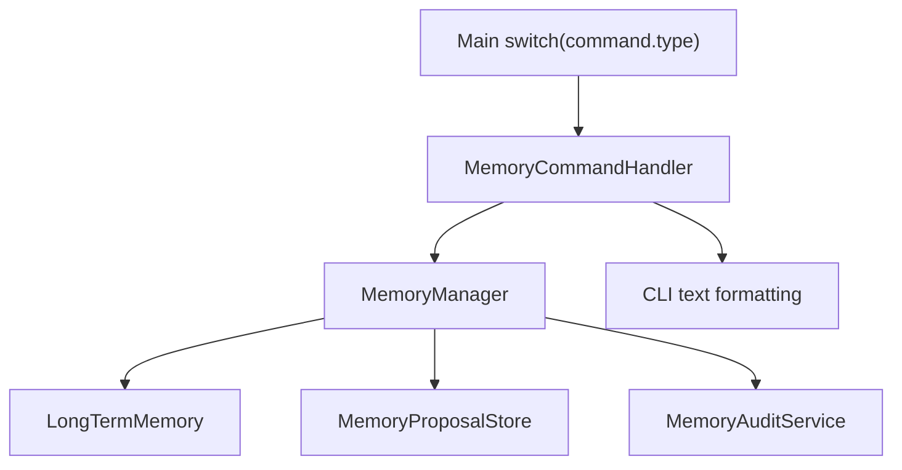

# MindCLI Main CLI `MemoryCommandHandler` 记忆命令拆分技术文档

文档类型: 批次级技术方案  
编写日期: 2026-08-10  
适用范围: `src/main/java/com/mindcli/cli/`, `src/main/java/com/mindcli/cli/command/`, `src/test/java/com/mindcli/cli/`, `AGENTS.md`

## 1. 背景

记忆系统已经具备企业级治理能力：策略检查、候选记忆、审批/拒绝、审计导出、删除 tombstone 和上下文注入过滤。当前这些能力的 CLI 入口仍散落在 `Main.java` 的巨大 switch 中，格式化 helper 也留在 `Main` 底部。

本批将记忆命令的入口层编排抽到 `MemoryCommandHandler`，让 `Main` 只负责命令路由。这样记忆系统的产品入口、治理文案和审计导出行为能在独立模块中维护。

## 2. 非目标

- 不改变长期记忆保存策略。
- 不改变候选记忆审批、拒绝、审计导出和删除行为。
- 不改变任何 `/memory ...` 或 `/save ...` 命令名称。
- 不改变输出文案。
- 不移动 `MemoryManager`、`LongTermMemory`、`MemoryPolicyEngine` 的领域逻辑。
- 不新增自动长期记忆提取能力。

## 3. 拆分范围

迁移到 `MemoryCommandHandler`:

- `/memory` 状态展示
- `/memory policy`
- `/memory proposals`
- `/memory export --audit`
- `/memory approve <id>`
- `/memory reject <id>`
- `/memory list`
- `/memory search <关键词>`
- `/memory delete <id>`
- `/memory clear`
- `/save [--project|--global] <事实>`
- 记忆条目和候选记忆的 CLI 格式化
- `/save` payload 解析

## 4. 目标结构

```text
cli/
├── Main.java
└── command/
    ├── MemoryCommandHandler.java
    ├── ConfigCommandHandler.java
    ├── ExportCommandHandler.java
    └── ...
```

## 5. 调用关系



## 6. 行为保持要求

- 空搜索词仍提示 `/memory search Chrome 登录态`。
- 空删除 id 仍提示 `/memory delete fact-abcd1234`。
- 空审批/拒绝 id 仍提示 proposal 示例。
- `/save --global` 和 `/save --project` 仍能解析作用域。
- 空 `/save` 仍提示示例。
- 长期记忆列表仍显示 id、scope、项目短路径、timestamp、content。
- 候选记忆列表仍显示 id、status、type、createdAt、name、content preview。
- 审计导出仍写到 `~/.mindcli/exports`。

## 7. 验证策略

TDD RED:

```bash
mvn test "-Dtest=MainMemoryCommandHandlerRefactorTest" -DskipTests=false
```

本批目标验证:

```bash
mvn test "-Dtest=MainMemoryCommandHandlerRefactorTest,CliCommandParserTest,MainInputNormalizationTest,MemoryManagerTest,MemoryAuditServiceTest" -DskipTests=false
```

最终回归:

```bash
mvn test -Pquick
git diff --check
```

## 8. 后续边界

本批完成后，`Main` 中仍剩模型切换、HITL 状态、MCP 管理、RAG 索引/搜索和交互输入循环。下一步若继续收敛，优先抽模型切换或 MCP 命令编排；交互循环应留到最后单独设计。
