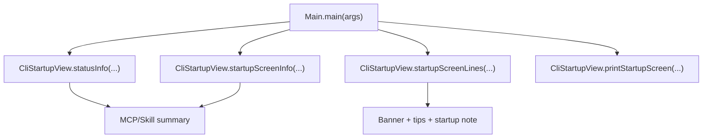

# MindCLI Main CLI `CliStartupView` 启动展示拆分技术文档

文档类型: 批次级技术方案  
编写日期: 2026-08-10  
适用范围: `src/main/java/com/mindcli/cli/`, `src/test/java/com/mindcli/cli/`, `AGENTS.md`

## 1. 背景

`Main.java` 已经将 slash command handler 与启动配置 helper 分离出去，但仍保留启动首屏、tips、MCP/Skill 摘要和底部状态信息拼装逻辑。这些代码属于 CLI 展示层，与主交互循环、命令路由和 Agent 执行路径不是同一个职责。

本批把纯展示/状态拼装逻辑抽到 `CliStartupView`，让 `Main` 继续作为入口 facade，只负责决定何时展示、何时更新状态。

## 2. 非目标

- 不改变 CLI 启动顺序。
- 不改变 Banner 文案、版本号展示、tips 或状态栏内容。
- 不改变 MCP / Skill 初始化流程。
- 不移动 JLine、Renderer、LineReader 生命周期。
- 不改变 slash command 处理逻辑。
- 不删除 `Main.*` 的测试兼容 facade。

## 3. 拆分范围

迁移到 `CliStartupView`:

- `printStartupHints(...)`
- `startupScreenInfo(...)`
- `statusInfo(...)`
- `mcpStatusSummary(...)`
- `skillStatusSummary(...)`
- `printStartupScreen(...)`
- `startupScreenLines(...)`
- `startupBannerLines(...)`
- `StartupScreenInfo` 数据结构

保留在 `Main` 的 facade:

- `startupBannerLines()`
- `startupScreenLines(...)`
- `statusInfo(...)`
- `printStartupHints(...)`
- `printStartupScreen(...)`

## 4. 目标结构

```text
cli/
├── CliBootstrap.java       # 启动配置、日志、默认 MCP config
├── CliStartupView.java     # 启动首屏、tips、状态摘要
├── Main.java               # CLI facade 与主流程
├── command/
└── interaction/
```

## 5. 调用关系



## 6. 行为保持要求

- `startupBannerLines()` 仍包含 `MindCLI`、`v16.1.0` 和 `Tips for getting started`。
- MCP 未配置时仍显示 `MCP not configured`，已配置时仍显示 `MCP ready/total · tools`。
- Skill 未配置时仍显示 `0 skills`，已配置时仍显示 enabled/total。
- Skill 启用数小于等于 2 时仍展示启用 skill 名称摘要。
- `StatusInfo` 仍追加 MCP / Skill 环境摘要。
- 非 inline renderer 仍通过 `PrintStream` 逐行打印启动首屏。

## 7. 验证策略

TDD RED:

```bash
mvn test "-Dtest=MainCliStartupViewRefactorTest" -DskipTests=false
```

本批目标验证:

```bash
mvn test "-Dtest=MainCliStartupViewRefactorTest,MainInputNormalizationTest,MindCliCompleterTest" -DskipTests=false
```

最终回归:

```bash
mvn test -Pquick
git diff --check
```

## 8. 后续边界

本批完成后，`Main` 仍会保留交互循环、任务执行分支、plan/team 创建和部分命令 facade。下一步若继续治理，应优先考虑 `CliRuntimeServerCommand` 或 `InteractiveCliSession`，但它们会接触生命周期编排，需要单独方案和更偏集成的验证。
