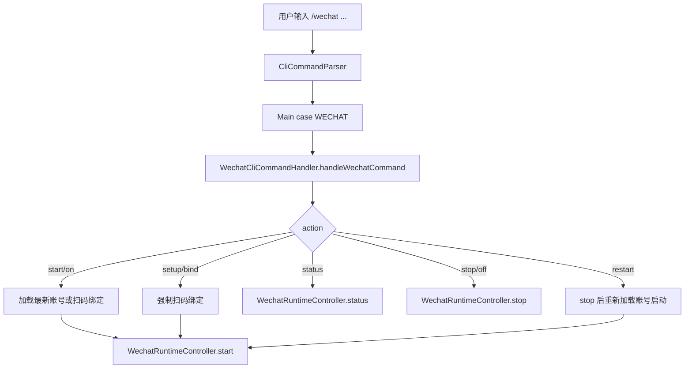

# MindCLI Main CLI `/wechat` 命令处理层拆分技术文档

文档类型: 批次级技术方案  
编写日期: 2026-08-10  
适用范围: `src/main/java/com/mindcli/cli/`, `src/test/java/com/mindcli/cli/`, `AGENTS.md`

## 1. 背景

`Main.java` 已经把 `/browser`、`/config`、`/export`、`/snapshot`、`/restore`、`/run inspect` 拆入 `cli/command/*`。当前 `/wechat` 仍在 `Main` 内部维护命令分派、扫码绑定、二维码轮询和进程内运行时控制器。该逻辑与 CLI 主循环强相关，但与 ReAct / Plan / Multi-Agent 执行链无直接耦合。

本批目标是把 `/wechat` 的命令处理与运行时控制器迁移到 `WechatCliCommandHandler`，让 `Main` 继续只负责命令入口分派、生命周期 hook 注册和输出。

## 2. 非目标

- 不改微信 iLink 协议调用、二维码登录参数或轮询间隔。
- 不改 `WechatAccountStore` 的账号存储路径和序列化格式。
- 不改 `WechatMessageLoop` 的消息处理、非交互式策略或 renderer 绑定。
- 不改 `/wechat` 用户可见命令、alias 和文案。
- 不改独立进程入口 `WechatCommandMain`。
- 不创建 Git commit。

## 3. 目标结构

```text
cli/
├── Main.java
└── command/
    ├── BrowserCommandHandler.java
    ├── ConfigCommandHandler.java
    ├── ExportCommandHandler.java
    ├── RunCommandHandler.java
    ├── SnapshotCommandHandler.java
    ├── SlashCommandCatalog.java
    └── WechatCliCommandHandler.java
```

## 4. 目标调用关系



```mermaid
sequenceDiagram
    participant Main
    participant Handler as WechatCliCommandHandler
    participant Store as WechatAccountStore
    participant Ilink as IlinkClient
    participant Runtime as WechatRuntimeController
    participant Loop as WechatMessageLoop

    Main->>Handler: handleWechatCommand(payload, lineReader, renderer, out, runtime)
    Handler->>Store: loadLatest()
    alt no account or setup
        Handler->>Ilink: startQrLogin("3")
        Handler->>Ilink: pollQrStatus(...)
        Handler->>Store: save(account)
    end
    Handler->>Runtime: start(account)
    Runtime->>Loop: new WechatMessageLoop(...)
    Runtime-->>Main: formatted status text
```

## 5. 拆分范围

迁移到 `WechatCliCommandHandler`:

- `handleWechatCommand(...)`
- `setupWechatAccount(...)`
- `waitWechatLogin(...)`
- `WechatRuntimeController`

保留在 `Main` 的兼容 facade:

- `handleWechatCommand(...)` 包内可见方法，内部委托 handler。

启动期 `WechatRuntimeController` 变量改为 `WechatCliCommandHandler.WechatRuntimeController`，shutdown hook 仍由 `Main` 注册。

## 6. 行为保持要求

- `/wechat` 默认 payload 仍等同于 `start`。
- `start/on` 仍优先加载最近绑定账号，没有账号时触发扫码绑定。
- `setup/bind` 仍强制扫码绑定并启动。
- `restart` 仍先停止，再加载账号或扫码绑定，然后启动。
- `status` / `stop/off` 文案保持不变。
- 用户 Ctrl+C / 中断仍返回“已取消微信通道操作。”。
- 异常仍包装为“微信通道操作失败: ...”。

## 7. 验证策略

TDD RED:

```bash
mvn test "-Dtest=MainWechatCommandHandlerRefactorTest" -DskipTests=false
```

本批目标验证:

```bash
mvn test "-Dtest=CliCommandParserTest,MainWechatCommandHandlerRefactorTest,WechatCommandParserTest,WechatPolicyDeciderTest" -DskipTests=false
```

CLI handler 回归:

```bash
mvn test "-Dtest=MainCommandHandlerRefactorTest,MainConfigCommandHandlerRefactorTest,MainBrowserCommandTest" -DskipTests=false
```

最终回归:

```bash
mvn test -Pquick
git diff --check
```

## 8. 后续批次

本批完成后，`Main.java` 的主要剩余结构治理是 `CliBootstrap`：把 Terminal / Renderer / LineReader / Runtime API / MCP 启动编排拆出。该批涉及启动路径和交互生命周期，风险明显高于命令 handler 拆分，需要单独文档和更完整验证。
